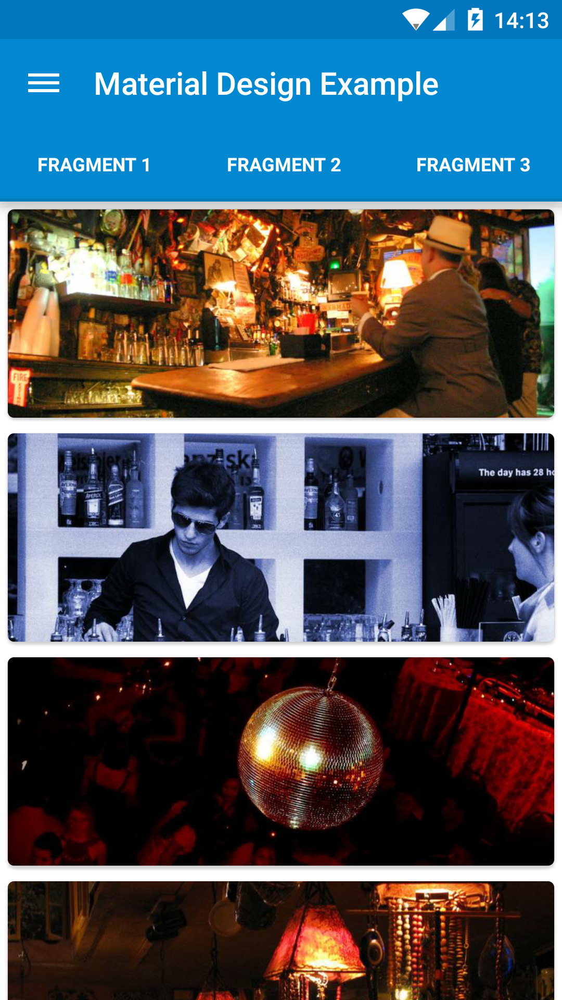
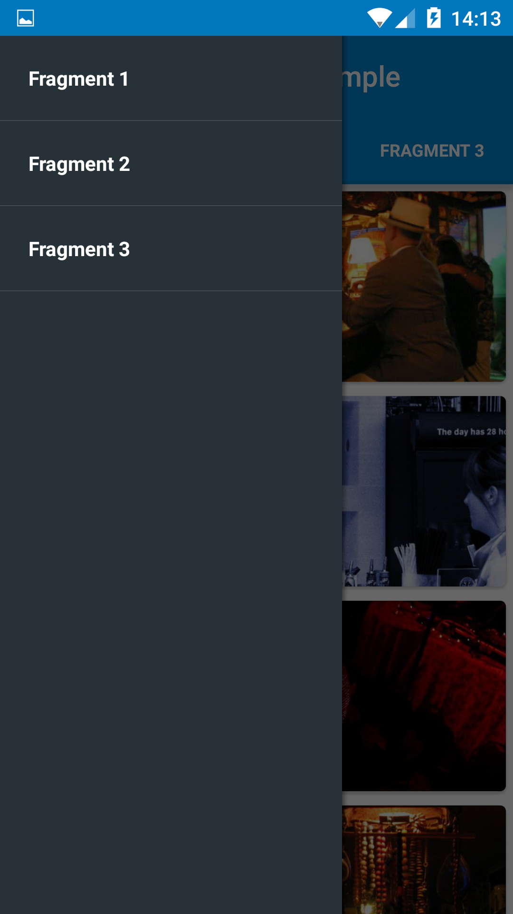

Material Design Example
========================

Material Design Example is a sample application for the new design concept made by Google, Material Design. Besides the design, we have the new APIs introduced in Android SDK Lollipop:

* Custom theme colors
* Circular reveal
* Activity transitions
* Toolbar
* Recycler View
* Card View
* Floating Action Button
* ObservableScrollView

Pre-requisites
--------------

*  Android SDK v14
*  Android Support Repository

Screenshots
-------------

 
 

Getting Started
---------------

This sample uses the Gradle build system. To build this project, use the
"gradlew build" command or use "Import Project" in Android Studio.

 Support
-------

If you've found an error in this sample, please file an issue:
https://github.com/halysongoncalves/Material-Design-Example

Patches are encouraged, and may be submitted by forking this project and
submitting a pull request through GitHub. Please see CONTRIBUTING.md for more details.

Contributions
---------------
Any contributions are welcome!  
Please check the [contributing guideline](https://github.com/halysongoncalves/Material-Design-Example/blob/master/CONTRIBUTING.md) before submitting a new issue.

Credits
---------------
* Inspired by `ObservableScrollView` in [romannurik-code](https://code.google.com/p/romannurik-code/).
* Inspired by `Android-ObservableScrollView` in [ksoichiro](https://github.com/ksoichiro/Android-ObservableScrollView).

Samples
---------------
  

<h2>Copyright</h2>

    Copyright 2014 Halyson Gonçalves. All rights reserved.

    Licensed under the Apache License, Version 2.0 (the "License");
    you may not use this file except in compliance with the License.
    You may obtain a copy of the License at

        http://www.apache.org/licenses/LICENSE-2.0

    Unless required by applicable law or agreed to in writing, software
    distributed under the License is distributed on an "AS IS" BASIS,
    WITHOUT WARRANTIES OR CONDITIONS OF ANY KIND, either express or implied.
    See the License for the specific language governing permissions and
    limitations under the License.

